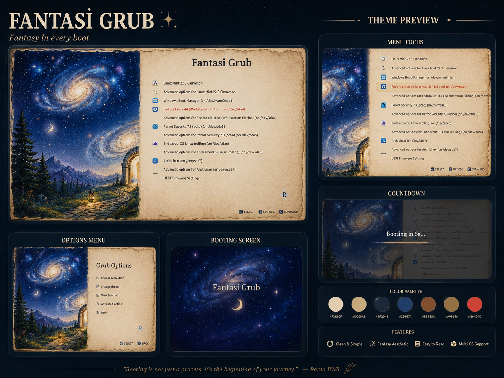

# 🌌 Fantasi GRUB Theme

A custom GRUB bootloader theme inspired by fantasy books, aged parchment, and the night sky.

The design combines a parchment-inspired interface with a dark galaxy background, creating a boot menu that feels closer to a fantasy book than a traditional system boot screen.

This theme was built as a personal Linux customization project. It also served as an opportunity to explore GRUB's theme system, interface layout, typography, and visual composition.



### 📥 Installation

1. Clone this repository:
```bash
git clone https://github.com/Mora-project-ui/fantasi-grub-theme.git
cd fantasi-grub-theme
```

2. Run the installer script:
```bash
chmod +x install.sh
sudo ./install.sh
```

3. Reboot your system to see your new grub! ✨
